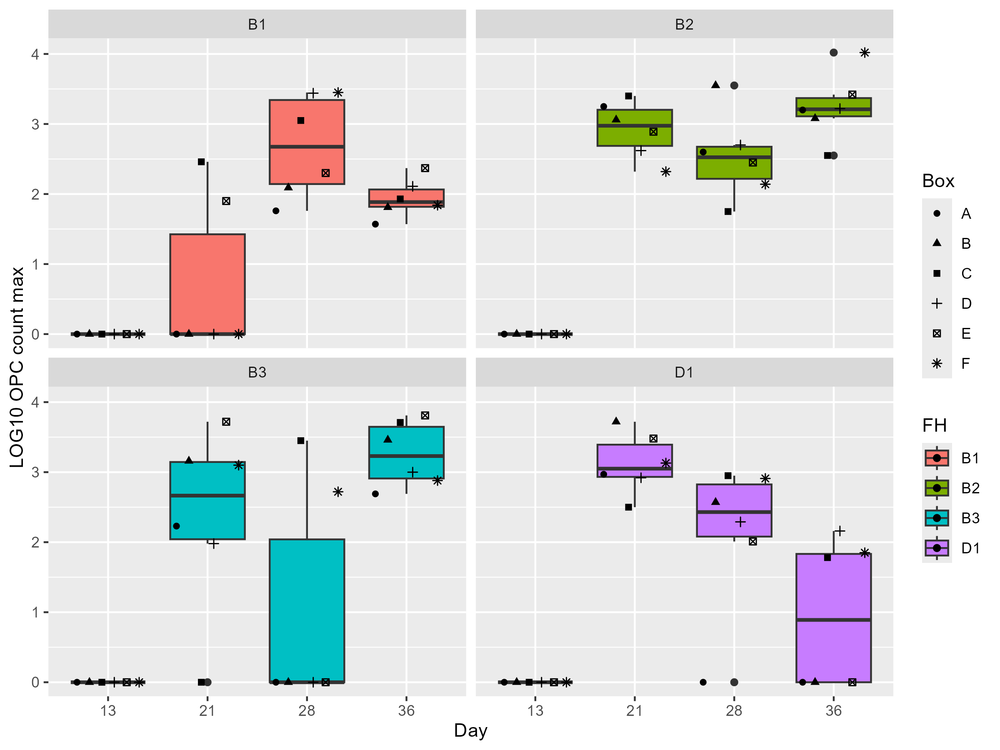

# Data Analysis Biomarkers
This is an edit I am making for practice. 

# Biomarkers (OVT/CALP) vs Coccidiosis Lesions

This project analyzes whether two inflammatory biomarkers — Ovotransferrin (OVT) and Calprotectin (CALP) — are associated with coccidiosis lesion scores, with a focus on Eimeria tenella lesion severity.

It includes:
- Data loading and cleaning from an Excel file
- Numeric conversion for European decimal formatting (e.g., `"1,5"` → `1.5`)
- Log10 transformation of biomarkers
- Ordinal regression models (diagnostic perspective): do biomarkers predict higher lesion scores?
- Linear models (biological perspective): which lesion scores and factors explain biomarker variation?
- Basic diagnostic checks and two jitter plots for interpretation
- To download the script via Github:
`git clone https://github.com/iram-gladan/data-analysis-biomarkers-.git`
- Project structure: 
```
data-analysis-biomarkers-/
- biomarkers_ovt_calp_vs_lesions.R   # Main analysis script
- 20260203_biomarker_ls.xlsx         # Input dataset
- README.md
```
---

## Requirements

- R (recommended: R version 4.5.0 2025-04-11 ucrt) 

- R packages:
  - `readxl`
  - `dplyr`
  - `janitor`
  - `stringr`
  - `MASS`
  - `ggplot2`
  - `here`

Install packages in R:

```r
install.packages(c("readxl","dplyr","janitor","stringr","MASS","ggplot2","here"))

```
Load them in the script

```
library(readxl)
library(dplyr)
library(janitor)
library(stringr)
library(MASS)
library(ggplot2)
library(here)
```
## Reproducibility with `renv`

This project uses `renv` to ensure reproducible package versions.  
The `renv.lock` file records the exact package versions used in the analysis.

---

### For collabroators (after cloning the repository)

Run the following in R:

```r
install.packages("renv")
renv::restore()
```

This will:
- Install all required packages
- Match the exact versions stored in `renv.lock`
- Create a project-specific library

---

### For project maintainer

If you install new packages or update existing ones, run:

```r
renv::snapshot()
```

This updates the `renv.lock` file.  
Commit the updated `renv.lock` file to GitHub.

---

### First-time setup (if `renv` has not been initialized)

From the project root directory:

```r
install.packages("renv")
renv::init()
renv::snapshot()
```




 
 